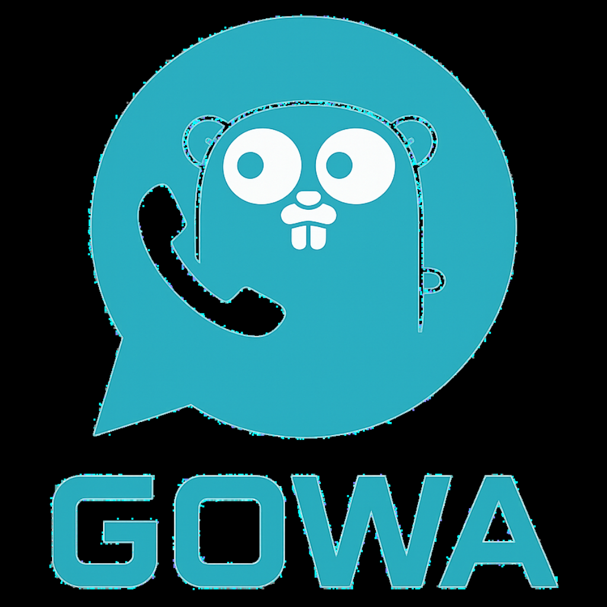

<div align="center">



# YGTWA

**Open-source WhatsApp Web REST API & MCP Bridge**

Built with Go · Maintained by [YGT Labs](https://github.com/IamYGT)

[](https://github.com/IamYGT/ygtwa/releases)
[](https://hub.docker.com/r/iamygt/ygtwa)
[](LICENCE.txt)
[](https://go.dev)

</div>

---

## Overview

**YGTWA** is a self-hosted WhatsApp Web bridge exposing a full REST API and [MCP](https://modelcontextprotocol.io) interface. It supports multiple WhatsApp accounts (multi-device) via a device ID header.

### Key Features

- Send & receive text, images, video, audio, documents, stickers, contacts, locations
- Call events — offer, accept, reject, terminated
- Group management — create, update, participants, invite links
- Webhook forwarding — configurable event whitelist
- Chat history — local SQLite storage with full message retrieval API
- MCP interface — AI agent integration via Model Context Protocol
- Basic Auth — secure multi-account access
- Multi-device — manage multiple WhatsApp numbers from one server

---

## Quick Start

### Docker (Recommended)

```bash
docker run -d \
  --name ygt-whatsapp \
  -p 3000:3000 \
  -v ygt_storages:/app/storages \
  -e APP_BASIC_AUTH=admin:password \
  -e WHATSAPP_WEBHOOK=https://your-app.com/webhook \
  iamygt/ygtwa:latest
```

### Docker Compose

```yaml
services:
  ygt-whatsapp:
    image: iamygt/ygtwa:latest
    container_name: ygt-whatsapp
    restart: unless-stopped
    ports:
      - "3000:3000"
    environment:
      - APP_BASIC_AUTH=admin:yourpassword
      - APP_OS=YGTWA
      - WHATSAPP_WEBHOOK=https://your-app.com/api/webhook
      - WHATSAPP_WEBHOOK_SECRET=your-secret
      - WHATSAPP_WEBHOOK_WHITELIST_EVENTS=message,message.ack,message.revoke,connection,call.offer,call.accept,call.reject,call.terminated
      - WHATSAPP_AUTO_REJECT_CALL=false
    volumes:
      - ygt_storages:/app/storages

volumes:
  ygt_storages:
```

### Build from Source

```bash
git clone https://github.com/IamYGT/ygtwa.git
cd ygtwa
docker build -f docker/golang.Dockerfile -t ygt-whatsapp:latest .
```

Or build the binary directly:

```bash
cd src
go mod download
go build -ldflags="-w -s" -o ../bin/ygt-whatsapp
./bin/ygt-whatsapp rest
```

---

## Configuration

All settings can be provided via **environment variables** or **CLI flags**.

| Environment Variable | CLI Flag | Default | Description |
|---------------------|----------|---------|-------------|
| `APP_PORT` | `--port` | `3000` | HTTP server port |
| `APP_HOST` | `--host` | `0.0.0.0` | Bind address |
| `APP_OS` | `--os` | `YGTWA` | Device name shown in WhatsApp linked devices |
| `APP_DEBUG` | `--debug` | `false` | Enable verbose logging |
| `APP_BASIC_AUTH` | `--basic-auth` | — | `user:password` for API auth |
| `APP_BASE_PATH` | `--base-path` | — | Sub-path prefix, e.g. `--base-path="/ygt"` |
| `WHATSAPP_WEBHOOK` | `--webhook` | — | Webhook URL for events |
| `WHATSAPP_WEBHOOK_SECRET` | — | `secret` | HMAC secret for webhook verification |
| `WHATSAPP_WEBHOOK_WHITELIST_EVENTS` | — | all | Comma-separated event types to forward |
| `WHATSAPP_AUTO_REJECT_CALL` | — | `false` | Auto-reject incoming calls |
| `WHATSAPP_AUTO_MARK_READ` | — | `false` | Auto-mark messages as read |
| `WHATSAPP_AUTO_DOWNLOAD_MEDIA` | — | `true` | Auto-download incoming media |
| `DB_URI` | `--db-uri` | SQLite | Database URI (SQLite or PostgreSQL) |

---

## API Reference

Full OpenAPI spec: [`docs/openapi.yaml`](docs/openapi.yaml)

Interactive docs available at `http://localhost:3000` after starting the server.

### Authentication

All API calls require `Authorization: Basic <base64(user:password)>` plus `X-Device-Id: <phone_number>` for multi-device routing.

### Core Endpoints

| Method | Endpoint | Description |
|--------|----------|-------------|
| `GET` | `/app/login` | Get QR code for device pairing |
| `GET` | `/app/login-with-code` | Pair via phone number code |
| `GET` | `/app/status` | Device connection status |
| `GET` | `/app/logout` | Disconnect device |
| `POST` | `/send/message` | Send text message |
| `POST` | `/send/image` | Send image |
| `POST` | `/send/audio` | Send audio / voice note |
| `POST` | `/send/video` | Send video |
| `POST` | `/send/document` | Send document/file |
| `POST` | `/send/sticker` | Send sticker |
| `POST` | `/send/location` | Send location |
| `POST` | `/send/contact` | Send contact card |
| `GET` | `/chat` | List conversations |
| `GET` | `/chat/{chatJid}/messages` | Get chat message history |
| `POST` | `/chat/mark-read` | Mark messages as read |
| `GET` | `/user/my/contacts` | Get contact list |
| `GET` | `/user/my/groups` | Get group list |
| `POST` | `/group` | Create group |
| `POST` | `/group/participants` | Add/remove participants |
| `GET` | `/message/{messageId}/revoke` | Revoke/delete message |

---

## Webhook Events

Configure which events to receive via `WHATSAPP_WEBHOOK_WHITELIST_EVENTS`:

| Event | Description |
|-------|-------------|
| `message` | Incoming/outgoing message |
| `message.ack` | Message delivery/read receipt |
| `message.revoke` | Message deleted by sender |
| `message.reaction` | Emoji reaction |
| `message.update` | Message edit |
| `message.deleted` | Message removed |
| `connection` | Device connect/disconnect |
| `call.offer` | Incoming call |
| `call.accept` | Call accepted |
| `call.reject` | Call rejected |
| `call.terminated` | Call ended |
| `group.joined` | Joined a group |
| `group.participants` | Participant list update |
| `contacts.upsert` | Contact info updated |

---

## MCP Interface

Start the MCP server:

```bash
./ygt-whatsapp mcp --port 8080
```

Exposes WhatsApp operations as MCP tools for AI agent integration (Claude, GPT, etc.).

---

## Multi-Device Support

Each WhatsApp number is a separate device. Route requests via the `X-Device-Id` header:

```bash
# Register a device
curl -u admin:pass -H "X-Device-Id: 905551234567" http://localhost:3000/app/login

# Send a message from that device
curl -u admin:pass -H "X-Device-Id: 905551234567" \
  -X POST http://localhost:3000/send/message \
  -F "phone=905559876543" -F "message=Hello!"
```

---

## Architecture

```
ygtwa/
├── src/
│   ├── cmd/                  # CLI commands (rest, mcp)
│   ├── config/               # settings.go — all app config
│   ├── domains/              # Interface definitions
│   ├── infrastructure/
│   │   ├── whatsapp/         # whatsmeow client, event handlers
│   │   ├── chatstorage/      # SQLite chat history
│   │   └── chatwoot/         # Optional Chatwoot integration
│   ├── ui/
│   │   ├── rest/             # Fiber HTTP handlers
│   │   ├── mcp/              # MCP tool handlers
│   │   └── websocket/        # Real-time WebSocket events
│   ├── usecase/              # Business logic
│   └── validations/          # Input validation
├── docker/
│   └── golang.Dockerfile     # Multi-stage Docker build
└── docs/
    ├── openapi.yaml          # Full API specification
    └── chatwoot.md           # Chatwoot integration guide
```

---

## Contributing

Contributions are welcome! Please open an issue first to discuss what you would like to change.

```bash
git clone https://github.com/IamYGT/ygtwa.git
cd ygtwa/src
go mod download
go test ./...
```

---

## License

[MIT](LICENCE.txt) © 2025 YGTWA

